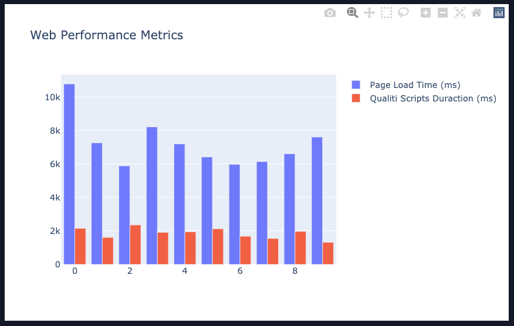
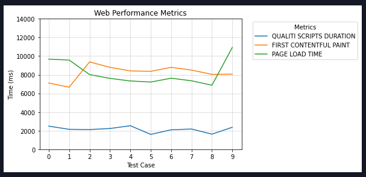

# Capture Web Performance Metrics

A collection of scripts, tests, and tools to capture web performance metrics.

- [Setup](#setup)
- [Run Tests to Capture Metrics](#run-tests-to-capture-metrics)
- [Visualize the Results with Graphs](#visualize-the-results-with-graphs)
- [Submit Bugs or Requests](#submit-bugs-or-requests)

## Setup

- 🐍 **_Python v3.8_** or higher is required
- 📦 **_Poetry_** as the package manager
- 👨🏽‍💻 Microsoft's Python extension installed in VSCode
- 🌎 Google Chrome browser installed on your machine

1. Clone the repo

   ```bash
   git clone https://github.com/qualiti-ai/web-perf-tools.git
   ```

2. Install packages with Poetry

   ```bash
   # Installs all packages from pyproject.toml file
   poetry install

   # Then copy the path of the virtual environment
   poetry env info --path
   ```

3. Configure VSCode to use the proper virtual environment

   - Open Command Palette (`CMD + SHIFT + P` or `CTRL + SHIFT + P`)
   - Find and click `Python: Select Interpreter`
   - Paste the virtual environment path if it's not listed

## Run Tests to Capture Metrics

```bash
poetry run pytest --csv=<name>.csv --count <count> -n <number> --url <url> -k web_performance_metrics
```

- Replace `<name>` with the **filename** you want to save the results to.
  > Make sure to add the `.csv` extension at the end!
- Replace `<count>` with the number of times you want to **repeat** the test
- Replace `<url>` with the **URL** to capture metrics from
- Replace `<number>` with the number of tests to **run in parallel**

For example:

```bash
poetry run pytest --csv=results.csv --count 6 -n 3 --url https://google.com -k web_performance_metrics
```

> This will run the test 6 times and use 3 separate browsers at the same time.

Once the tests are complete, it will generate a `results.csv` file (or whatever you replaced `<name>` with) at the Project Root.

> NOTE: This file will be overriden each time you run the tests, so move or rename it if you want to keep it.

## Visualize the Results with Graphs




Qualiti may ask you to send different `results.csv` files for different test runs and environments. However, we have provided a couple ways for you to visualize the results as well:

- [Interactive Jupyter Notebook](#interactive-jupyter-notebook)
- [Run main.py script](#run-main-script)

### Interactive Jupyter Notebook

Open the `results.ipynb` notebook found at the Project Root and make sure you have at least _1 results file_. Otherwise, there is nothing to visualize!

> You may need to install the `Jupyter Notebook` extension in VS Code.

Start at the top and run each cell. You can edit or add cells however you'd like for an interactive experience with the data!

### Run main script

```bash
poetry run python main.py
```

By default, this will look for a `results.csv` file at the Project Root and use that to create a bar chart.

If your results file has a different name, then change the name in `main.py`, save the file, and run the script again.

## Submit Bugs or Requests

If you've found an bug or you have an idea or feature request, please create an issue on the [Issues Tab](https://github.com/qualiti-ai/web-perf-tools/issues)
